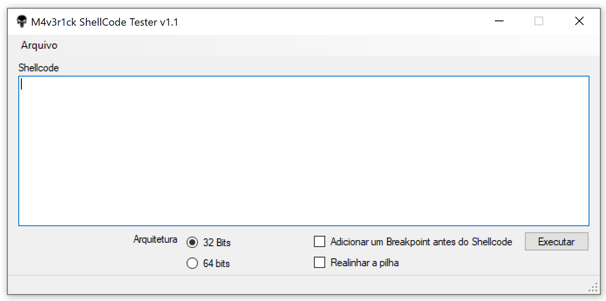
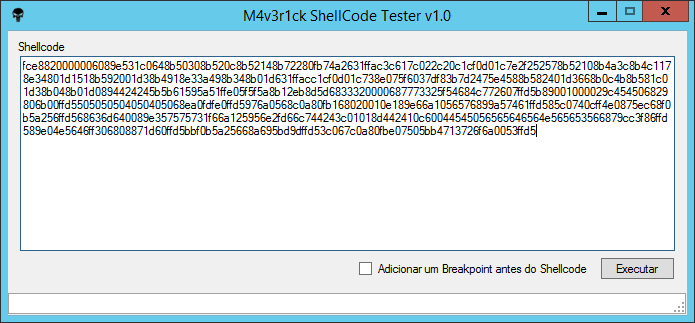

ShellCode Tester Windows
##########

This tools test generated ShellCodes.

Usage
=====



Exemple
=======

.. image:: ./images/msfvenon.png



ShellCode Tester Linux
##########

Instalation
=====
```
git clone https://github.com/helviojunior/shellcodetester.git
cd shellcodetester/Linux
make
```

Usage
=====
Without break-point
```
shellcodetestes [file.asm]
```

With break-point (INT3). The break-point will be inserted before our generated shellcode.
```
shellcodetestes [file.asm]
```
