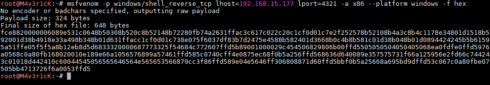
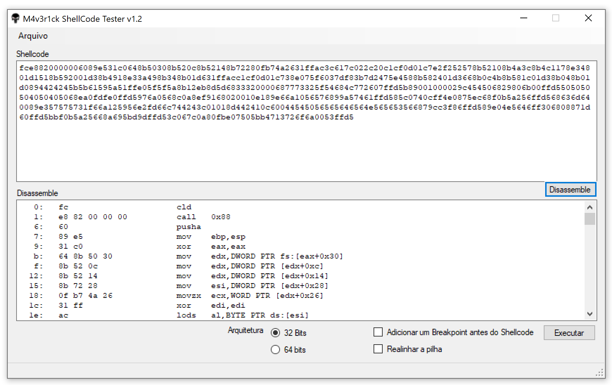

ShellCode Tester Windows
##########

This tools test generated ShellCodes.

Usage
=====

.. image:: ./Windows/images/main.png

Exemple
=======

ShellCode Tester Linux
##########

Instalation
=====
::

    git clone https://github.com/helviojunior/shellcodetester.git
    cd shellcodetester/Linux
    make

Usage
=====
Without break-point::

    shellcodetester [file.asm]

With break-point (INT3). The break-point will be inserted before our generated shellcode::

    shellcodetester [file.asm] --break-point

