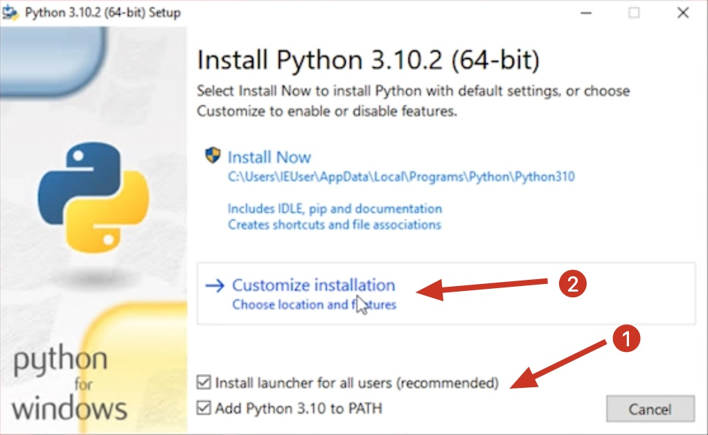
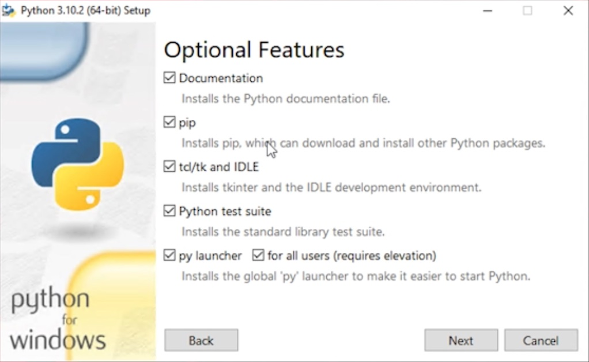
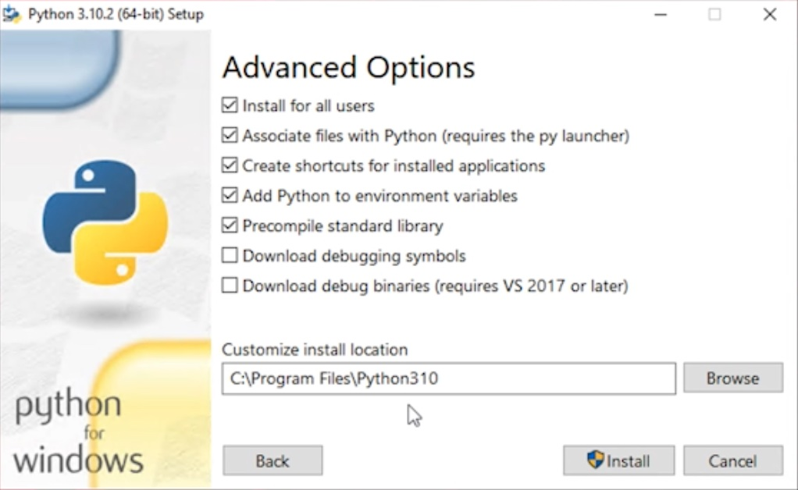
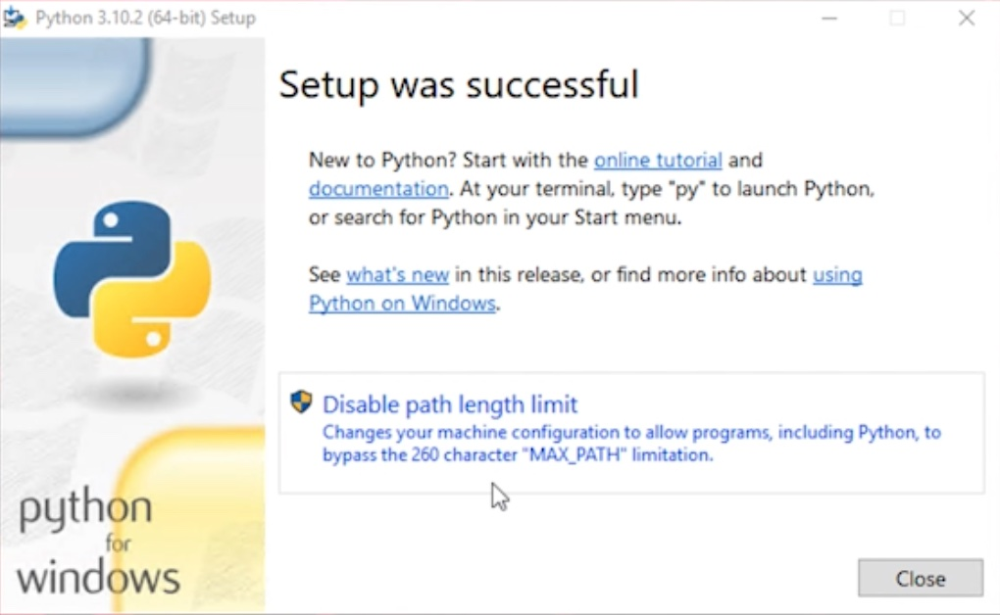
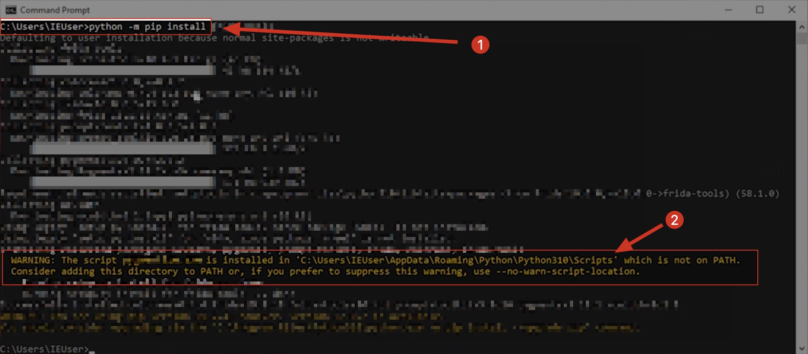

# Shellcode Tester for Windows Users

This file shows the specific procedures to Windows users.

## General README

Before start this, please, views our general [README](README.md)

### Installing Python3
1. Download the latest version of Python3 from [Python3](https://www.python.org/downloads/windows/)
2. Install Python3 for wide system users (as the step-by-step bellow)
3. Make sure to put python at Windows SYSTEM PATH  

#### Installing Python step-by-step

1. Download the latest version of Python3 from [Python3](https://www.python.org/downloads/windows/)
**Note:** For this project we recommend Python version up to 3.10

2. Execute python installer
3. Select the options
   1. Install launcher for all users
   2. Add Python to PATH


4. Select the following optional features
   1. pip
   2. py laucher
   3. for all users


4. Select the following advanced options
   1. Install for all users
   2. Associate files...
   3. Add Python to environment variables


4. Install Python
5. After install, disable path length limit


#### Set modules folder to windows PATH

After you install any package (as shellcodetester example) using `pip install shellcodetester` or `pythin -m pip install shellcodetester` you can receive a message indicating the python scripts folder is not present at SYSTEM Environment PATH, so check this message and path and set this one at your SYSTEM environment PATH




### NASM
1. Download the latest version of NASM from [NASM](https://www.nasm.us/)
2. Install NASM
3. Put NASM binary folder `C:\Program Files (x86)\NASM\` at Windows SYSTEM PATH  

### ObjDump
1. Download Binutils from [SourceForge BinUtils](https://sonik.dl.sourceforge.net/project/mingw/MinGW/Base/binutils/binutils-2.28/binutils-2.28-1-mingw32-bin.tar.xz)
2. Create the program files path `C:\Program Files (x86)\BinUtils\`
3. Extract download file and put all content of `C:\Program Files (x86)\BinUtils\`
4. Put Binutils binary folder `C:\Program Files (x86)\BinUtils\bin` at Windows SYSTEM PATH  

### Install GCC
In order to install GCC you have several options
1. Install Visual Studio (the best option)
2. Install MinGW64 from [Last Release](https://github.com/helviojunior/shellcodetester/releases/latest/download/mingw-latest.zip)
3. Install Dev C++ (the simplest one)

#### Installing DEV C++
1. Download Dev C++ from [SourceForge Dev C++](https://sourceforge.net/projects/orwelldevcpp/)
2. Install Dev C++   
3. Put MinGW64 binary folder `C:\Program Files (x86)\Dev-Cpp\MinGW64\bin` at Windows SYSTEM PATH  

### Visual C++ 2015-2019
Depending on the version of your Windows maybe you will need install Visual Studio C++

- Download and Install [VC_redist.x64.exe](resources/VC_redist.x64.exe)
- Download and Install [VC_redist.x86.exe](resources/VC_redist.x86.exe)

## Optional procedures

Depending on what you will test, maybe you will need to disable some windows protections, so follows the instructions.

### Disable Windows update 

[How to Turn Off Automatic Updates on Windows 10](https://www.cleverfiles.com/howto/disable-update-windows-10.html)

### Disable Windows Defender

[How to permanently disable Windows Defender Antivirus on Windows 10](https://www.windowscentral.com/how-permanently-disable-windows-defender-antivirus-windows-10)

### Disable Windows Firewall

[How to Disable a Windows Firewall](https://www.techwalla.com/articles/how-to-disable-a-windows-firewall-with-gpedit)

### Disable DEP

Open an elevated Command Prompt and run the command bellow

```cmd
bcdedit.exe /set {current} nx AlwaysOff
```

### Disable ASLR

Download reg file [Disable_ASLR.reg](resources/Disable_ASLR.reg)

Open an elevated Command Prompt and run the command bellow

```cmd
Regedit.exe Disable_ASLR.reg
```

or open an elevated Powershell prompt and run the command bellow

```pss1
Set-ItemProperty -Path "HKLM:SYSTEM\CurrentControlSet\Control\Session Manager\Memory Management" -Name MoveImages -Type DWord -Value 0
```

### Disable SEHOP

Download reg file [Disable_SEHOP.reg](resources/Disable_SEHOP.reg)
Open an elevated Command Prompt and run the command bellow

```cmd
Regedit.exe Disable_SEHOP.reg
```

or open an elevated Powershell prompt and run the command bellow

```pss1
Set-ItemProperty -Path "HKLM:SYSTEM\CurrentControlSet\Control\Session Manager\kernel" -Name DisableExceptionChainValidation -Type DWord -Value 1
```
